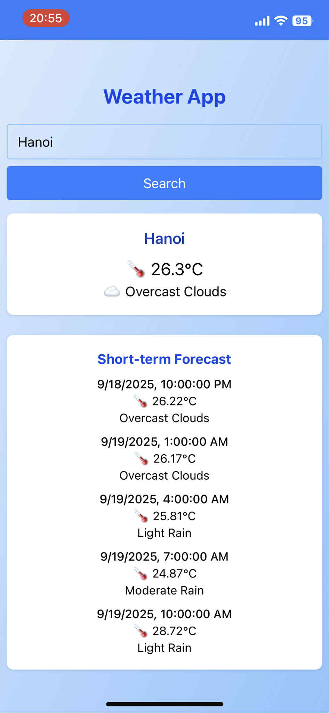

# Weather App Setup Guide

Follow these steps to create a PWA weather app using Vite, React, Tailwind CSS, and OpenWeatherMap.

## 1. Create the App
```bash
npx create-next-app weather-app
cd weather-app
```

## 2. Get OpenWeatherMap API Key
- Sign up at [OpenWeatherMap](https://openweathermap.org/).
- Go to your account and create an API key.
- Add your key to a `.env` file:
```
VITE_OPEN_WEATHER_API_KEY=your_api_key_here
```

## 3. Install Tailwind CSS (Optional for flexible CSS)
Follow the official guide: [Tailwind + Vite](https://tailwindcss.com/docs/installation/using-vite)
```bash
npm install -D tailwindcss postcss autoprefixer
npx tailwindcss init -p
```
- Configure `tailwind.config.js` and add Tailwind directives to your CSS.

## 4. Install vite-plugin-pwa and Configure
```bash
npm install vite-plugin-pwa --save-dev
```
Add the following to your `vite.config.ts`:
```ts
import { defineConfig } from 'vite';
import react from '@vitejs/plugin-react';
import { VitePWA } from 'vite-plugin-pwa';

export default defineConfig({
  plugins: [
    react(),
    VitePWA({
      registerType: 'autoUpdate',
      manifest: {
        name: 'Weather App',
        short_name: 'Weather',
        start_url: '/',
        display: 'standalone',
        background_color: '#ffffff',
        theme_color: '#317EFB',
        icons: [
          {
            src: '/icon-192.png',
            sizes: '192x192',
            type: 'image/png'
          },
          {
            src: '/icon-512.png',
            sizes: '512x512',
            type: 'image/png'
          }
        ]
      }
    })
  ]
});
```

## 5. Build, Preview, and Add to Home Screen
```bash
npm run build
npm run preview -- --port=4173
```
- Open your browser and go to `http://localhost:4173` (or the port you chose).
- Use your browser's menu to "Add to Home Screen".
- The app will now open as a standalone PWA from your home screen.

---

## Demo
[video](https://drive.google.com/file/d/1v6fb8_0YDOYtk6W56ujoFS_NkdZUIGwa/view?usp=sharing)




Enjoy your Weather App!
